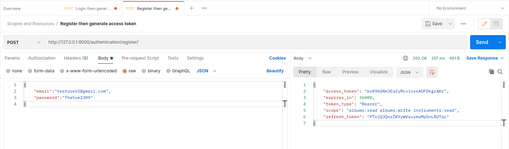
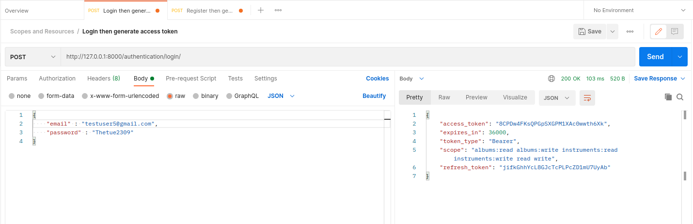

# Create Account From HRM Project

## Create model User 

- Model User using with Role : 
    - Class Role : 
    
            class Role(models.Model):
                name = models.CharField(max_length=255)
                permissions_role = models.TextField(null=True)
                description = models.TextField()
            
                def __str__(cls):
                    return cls.name
    
    
## Create model Base User 

- Class UserManager : 
      
            class UserManager(BaseUserManager):
                def create_user(cls, email, password=None):
                    """
                    Creates and saves a User with the given email and password.
                    """
                    if not email:
                        raise ValueError('Users must have an email address')
            
                    user = cls.model(
                        email=cls.normalize_email(email),
                    )
            
                    user.set_password(password)
                    user.save(using=cls._db)
                    return user
            
                def create_staffuser(cls, email, password):
                    """
                    Creates and saves a staff user with the given email and password.
                    """
                    user = cls.create_user(
                        email,
                        password=password,
                    )
                    user.staff = True
                    user.save(using=cls._db)
                    return user
            
                def create_superuser(cls, email, password):
                    """
                    Creates and saves a superuser with the given email and password.
                    """
                    user = cls.create_user(
                        email,
                        password=password,
                    )
                    user.staff = True
                    user.admin = True
                    user.save(using=cls._db)
                    return user

## Add Role merge with model User

# Test Generate Access Token  

## Test Register with Model User and get access token

## Test  Login with access token

